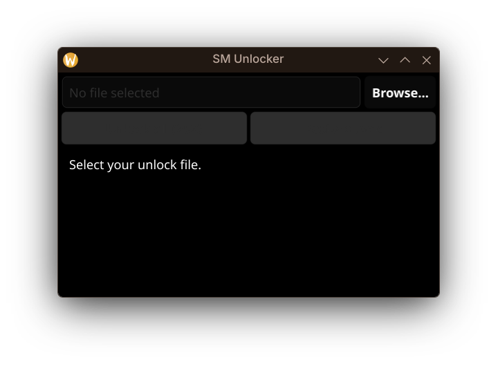

# SM Unlocker

[](https://github.com/AndreyPrima/ScrapMechanicUnlocker/releases/latest) [](https://github.com/AndreyPrima/ScrapMechanicUnlocker/actions)

Unlock all **252** Scrap Mechanic outfits in one click.



## Download

Grab the latest release: **[Download SM Unlocker](https://github.com/AndreyPrima/ScrapMechanicUnlocker/releases/latest)**

- Linux: `sm-unlocker-linux`
- Windows: `sm-unlocker-windows.exe`

## Use

1. Open the app. It finds your `unlock` file on its own. If not, press **Browse** or paste the path.
2. Press **Unlock all (252)**.
3. Done. Play.

Point the app at the file inside the `User_<id>` folder so it reads your Steam ID. Your original file stays safe as `unlock.bak`, and **Restore .bak** brings it back.

## Origin

Rebuilt from the original closed-source `.exe` in Go + Fyne. Same unlock format, byte for byte.

## Developers

<details>
<summary>Run, build, test</summary>

```sh
go run .
go test ./... -count=1
```

Build for Linux:

```sh
go build -ldflags="-s -w" -o sm-unlocker-linux .
```

Cross-compile for Windows from Linux with `x86_64-w64-mingw32-gcc` installed:

```sh
CGO_ENABLED=1 CC=x86_64-w64-mingw32-gcc CXX=x86_64-w64-mingw32-g++ \
GOOS=windows GOARCH=amd64 \
go build -ldflags="-s -w -H=windowsgui" -o sm-unlocker-windows.exe .
```

Layout: `main.go`, `theme/`, `ui/`, `internal/unlock/`, `internal/steam/`, `internal/service/`.

</details>

## Bugs

Open an issue with your OS and the status line text.
